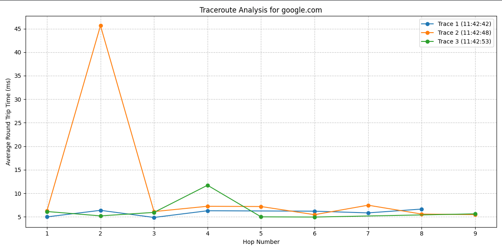

[](https://classroom.github.com/open-in-codespaces?assignment_repo_id=18568105)
# The Amazing Trace

Amazing Trace is a Python utility for running and visualizing traceroute data. It performs multiple traceroutes to specified destinations, calculates round-trip times (RTT), and generates visual graphs of the network path.

## Project Overview

Amazing Trace helps network administrators and curious users understand the path that internet traffic takes to reach various destinations. It provides:

- Execution of traceroute commands with proper privileges
- Parsing of traceroute output into structured data
- Visualization of multiple traceroutes for comparison
- Analysis of network latency at each hop

## Project Structure

```
amazing-trace/
│
├── amazing_trace.py    # Main script file
├── README.md           # This documentation
└── output/             # Directory where graphs are saved (created automatically)
```

## Prerequisites

Before running The Amazing Trace, ensure you have the following Python packages installed:

```
pip install matplotlib pandas numpy
```

The script also requires `traceroute` to be installed on your system and sudo privileges to run it.

## Usage

1. Open `amazing_trace.py` and modify the `destinations` list in the `if __name__ == "__main__":` section to include the hostnames or IP addresses you want to trace.

2. Run the script:
   ```
   python3 amazing_trace.py
   ```

3. The script will:
   - Run multiple traceroutes to each destination (default: 3 traces)
   - Wait between traces (default: 5 seconds)
   - Generate a graph for each destination
   - Save the graphs in the `output` directory

## Understanding the Output

The script generates a line graph for each destination showing:
- Round-trip time (in milliseconds) on the Y-axis
- Hop number on the X-axis
- Different colored lines for each trace run

### Timeouts

In network tracing, some hops may "time out" (indicated by asterisks in the traceroute output). This happens when:
- The router is configured not to respond to ICMP requests
- There are network issues
- Firewalls are blocking responses

If you see missing points on the graph, it's likely because those hops timed out during the trace. The script handles timeouts gracefully and continues to the next available hop.

## Code Explanation

### Traceroute Execution

The `execute_traceroute` function runs the traceroute command with sudo privileges and the `-I` flag to use ICMP echo requests:

```python
def execute_traceroute(destination):
    raw_output = subprocess.run(["sudo", "traceroute", "-I", destination], capture_output=True, text=True, check=True)
    return raw_output.stdout
```

### Parsing Traceroute Output

The `parse_traceroute` function uses regex to extract information from the traceroute output:

```python
regex = r'(\d+)\s+([^\s]+)\s+\(([^)]+)\)\s+((?:\d+\.\d+\s+ms\s+)+|\*+\s+\*+\s+\*+|\s*)'
```

This regex is broken down as follows:

1. `(\d+)` - Group 1: Captures the hop number (a sequence of digits)
2. `([^\s]+)` - Group 2: Captures the hostname (any non-whitespace characters)
3. `\(([^)]+)\)` - Group 3: Captures the IP address inside parentheses
4. `((?:\d+\.\d+\s+ms\s+)+|\*+\s+\*+\s+\*+|\s*)` - Group 4: Captures the RTT times, which can be either:
   - A sequence of decimal numbers followed by "ms" (for successful responses)
   - A series of asterisks (for timeouts)
   - Empty in some cases

### Visualization

The `visualize_traceroute` function:
- Runs multiple traceroutes to the same destination
- Parses and aggregates the results
- Generates a plot showing RTT for each hop
- Saves the plot to the output directory

## Example Output

When running the script with default destinations (google.com, amazon.com, bbc.co.uk), you'll get:
- Three separate graph files in the `output` directory
- Console output showing average RTT for each hop
- Timestamps indicating when each trace was performed

Each graph provides a visual representation of the network path to the destination, making it easy to identify bottlenecks or inconsistencies in routing.

## Example Graph

